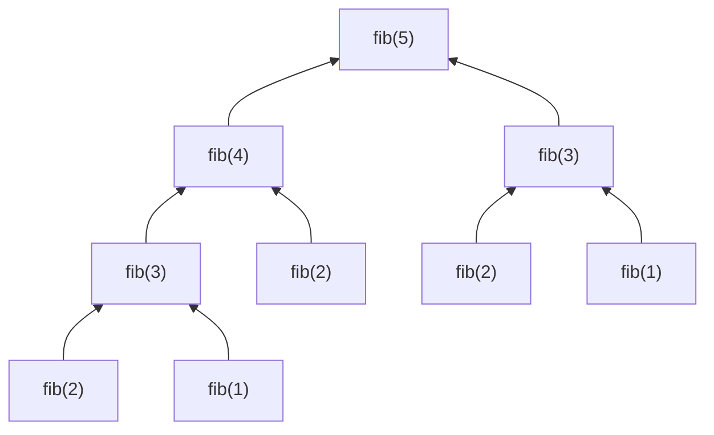
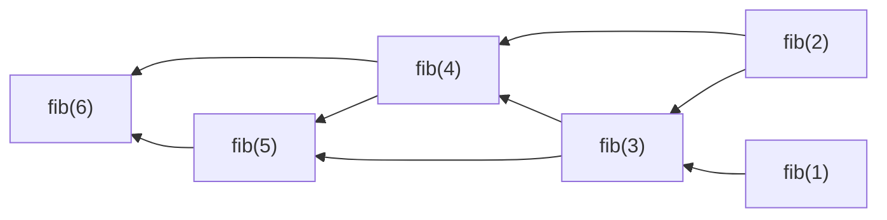
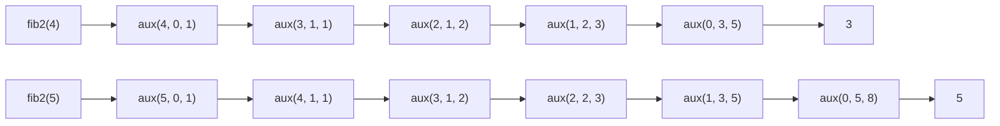

# 3. Functions, Lists & Recursion

<!--
```moonbit
let pi = 3.1415

fn put(map: @immut/sorted_map.T[Int, Int64], num: Int, result: Int64) -> @immut/sorted_map.T[Int, Int64] {
  map.insert(num, result)
}

fn get(map: @immut/sorted_map.T[Int, Int64], num: Int) -> Option[Int64] {
  map.lookup(num)
}

fn make() -> @immut/sorted_map.T[Int, Int64] {
  @immut/sorted_map.empty()
}

```
-->

## Functions

In different subjects, the meaning of the word "function" has subtle differences.

In mathematics, functions, such as quadratic functions, logarithmic functions, and trigonometric functions, are defined as the mapping relationships between sets. One of their most important characteristics is that a function always maps each element in the domain to one and only one element in the codomain.

In computer science, on the other hand, it is an abstraction of repeated operations. The use of functions can reduce duplication of code. For example, to calculate the area of a circle with $r = 1$, we should calculate $\pi\cdot 1^2$; to calculate the area of a circle with $r = 2$, we should calculate $\pi\cdot 2^2$... However, for different radii $r$, should we really need to repeat the same pattern over and over again? Generally speaking, when writing a program, if the same pattern appears multiple times, we can consider abstracting it.

Consider this code snippet:

```moonbit expr
let surface_r_1: Double = { let r = 1.0; pi * r * r }
let surface_r_2: Double = { let r = 2.0; pi * r * r }
let surface_r_3: Double = { let r = 3.0; pi * r * r }
let result = (surface_r_1, surface_r_2, surface_r_3)
```

By defining the function `area`, we can abstract the repetitive pattern of computation: given the radius of a circle, calculate its area.

```moonbit expr
fn area(radius: Double) -> Double { pi * radius * radius }
let result = (area(1.0), area(2.0), area(3.0))
```

### Definition of Top-Level Functions

Recall that a function is called a top-level function if it is defined outside of any expression block. In MoonBit, they can be defined using the following syntax:

```text
fn <func name> (<param name>: <type>, <param name>: <type>, ...) -> <type> <expr block>
```

The number of parameters can be zero or more, but the names of parameters cannot be repeated. For example:

```moonbit
fn one () -> Int {
  1
}

fn add_char(ch: Char, str: String) -> String {
    ch.to_string() + str
}
```

This syntax enables you to use a function using the interface it provides, without needing to know the details of how it is implemented.

### Function Application and Evaluation

If a function is defined, it can be **applied** with `<func name>(<expr>, <expr>...)`, e.g., `one()` and `add_char('m', "oonbit")`. When applying a function, it is important to ensure that the number of parameters and their types align with the function definition. That is, the order of parameters cannot be disrupted: ~~`add_char("oonbit", 'm')`~~.

The evaluation of a function application follows the following steps:

- Evaluate the parameters **from left to right**.
- Replace the occurrences of the parameters with their values.
- Reduce the expressions in the function body.

For example:

```moonbit expr
fn add_char(ch: Char, str: String) -> String {
  ch.to_string() + str
}

let moonbit: String = add_char(Char::from_int(109), "oonbit")
```

The evaluation process of the above code snippet is as follows:

$$
\begin{aligned}
  & \texttt{add\_char(Char::from\_int(109), "oonbit")} \\
  \mapsto & \texttt{add\_char('m', "oonbit")} & \text{because \texttt{Char::from\_int(109)} $\mapsto$ \texttt{'m'}} \\
  \mapsto & \texttt{'m'.to\_string() + "oonbit"} & \text{replace the occurrences of the parameters} \\
  \mapsto & \texttt{"m" + "oonbit"} & \text{because \texttt{m.to\_string()} $\mapsto$ \texttt{"m"}} \\
  \mapsto & \texttt{"moonbit"} & \text{because \texttt{"m" + "oonbit"} $\mapsto$ \texttt{"moonbit"}}
\end{aligned}
$$

### Partial Functions

Some functions are referred to as **partial functions** as they may not define an output for every possible input in the domain.

```moonbit expr
let ch: Char = Char::from_int(-1) // Invalid: -1 does not correspond to a character.
let nan: Int = 1 / 0 // Forbidden: It will cause an runtime error.
```

The first one is invalid, since in Unicode, no character has a negative encoding; the second one is also forbidden because integers cannot be divided by $0$. In both cases, the argument type aligns with the function definition but the function application is still erroneous.

In contrast with partial functions, the functions that do define an output for every input are called **total functions**.

To prevent program termination caused by forbidden operations and to distinguish between valid and invalid inputs, the `Option[T]` data type is employed.

A value of type `Option[T]` falls into one of the two cases:

- `None`: the absence of a value.
- `Some(value: T)`: the presence of a value of type `T`.

For example, we can define a total function for integer division using the option type:

```moonbit expr
fn div(a: Int, b: Int) -> Option[Int] {
  if b == 0 { None } else { Some(a / b) }
}
```

If `b == 0`, we will return `None` instead of raising an error; otherwise, we will return the quotient wrapped by `Some`.

In `Option[T]`, the notation `[T]` indicates that `Option` is a generic type, and the value it holds is of type `T`. For example:

- `Option[Int]`: it can either hold a value of type `Int` or it can be empty.

We will explore how to extract the value from `Some` shortly.

### Definition of Local Functions

Thanks to the powerful type inference capabilities of the MoonBit compiler, defining local functions is much easier than defining top-level functions. In most cases, the parameter types and the return type of a local function can be omitted, and even its name can also be omitted. If a function is not named when it is defined, it is called an "anonymous function". For example:

```moonbit expr
let answer: () -> Int = fn () {
  fn real_answer(i) {
    42
  }
  real_answer("Ultimate Question")
}

let x: Int = answer() // 42
```

In the above example, an anonymous function is defined and then bound to `answer`, and the function itself also calls another local function named `real_answer`. The return type of `real_answer` is inferred by the compiler, since it returns an integer value. Consequently, the return type of the function bound to `answer` can also be easily figured out.

In `real_answer`, the type of the parameter `i` is not specified, and cannot be inferred from the function body of `real_answer`. However, since the argument `"Ultimate Question"` is a string, the compiler can determine that the type of `real_answer` is `(String) -> Int`. Even if the argument is changed to an expression of another type, the compiler can still infer the correct type, thanks to its powerful type inference capabilities. However, it is important to note that the number of arguments should still be one.

In MoonBit, functions are considered "first-class citizens", i.e., they can be used as parameters, return values, and can also be assigned or stored.

### Function Types

In MoonBit, function types have the following form:

```text
(<param type>, <param type>, <param type>, ...) -> <return type>
```

For example:

- `() -> Int`
- `(Int, String, Char) -> Int`
- `((Int, Int, Int)) -> (Int, Int, Int)` accepts a tuple and returns a tuple

Since `->` is right-associative, in the last example, the brackets in the return type can be omitted.

### Labeled Arguments and Optional Arguments

It is not uncommon to encounter difficulties recalling the order of parameters when calling a function, particularly when multiple parameters share the same type. In such situations, referring to documentation or IDE prompts can be helpful. However, when reviewing code written by others, these resources may not be readily available. To overcome this challenge, labeled arguments offer a practical solution. In MoonBit, we can make a parameter "labeled" by prefixing it with `~`. For instance, consider the following code snippet:

```moonbit
fn greeting1(~name: String, ~location: String) -> Unit {
  println("Hi, \{name} from \{location}!")
}

fn init {
  greeting1(~name="somebody", ~location="some city")
  let name = "someone else"
  let location = "another city"
  // `~label=label` can be abbreviated as `~label`
  greeting1(~name, ~location)
}
```

By using labeled arguments, the order of the parameters becomes less important. In addition, they can be made optional by specifying a default value when declaring them. When the function is called, if no argument is explicitly provided, the default value will be used.

Consider the following example:

```moonbit
fn greeting2(~name: String, ~location: Option[String] = None) -> Unit {
  match location {
    Some(location) => println("Hi, \{name}!")
    None => println("Hi, \{name} from \{location}!")
  }
}

fn init {
  greeting2(~name="A") // Hi, A!
  greeting2(~name="B", ~location=Some("X")) // Hi, B from X!
}
```

It is important to note that the default value expression will be evaluated each time the function is called.

## Lists

Data is everywhere. Sometimes, we have data with the following characteristics:

- The data is ordered.
- The data can be duplicated.
- The data can vary in length.

For instance, let's consider the organization of our natural language snippets. They are arranged in a specific order, can be duplicated, and can vary in length. Another example is the DNA sequence fragments, which consist of four nucleobases that are repeated in a certain order and differ in length. To effectively represent such data in a computer system, we employ a data structure known as a list.

### Definition of a List

Here, we will define a single-ended immutable integer list called `IntList`, where items can only be inserted at one and only one end, known as the head.

Let's recall the workflow introduced in Chapter 1. After understanding the problem, we should define the interfaces, i.e., the operations that should be supported:

- Construction
  - `nil : () -> IntList`: construct an empty list
  - `cons : (Int, IntList) -> IntList`: add a new item into the list
- Deconstruction
  - `head_opt : IntList -> Option[Int]`: get the first item
  - `tail : IntList -> IntList`: get the rest items

Then, we should write the test cases:

```moonbit no-check
let empty_list: IntList = nil()
@assertion.assert_eq(head_opt(empty_list), None)?
@assertion.assert_eq(tail(empty_list), empty_list)?

let list1: IntList = cons(1, empty_list)
@assertion.assert_eq(head_opt(list1), Some(1))?
@assertion.assert_eq(tail(list1), empty_list)?

let list2: IntList = cons(2, list1)
@assertion.assert_eq(head_opt(list2), Some(2))?
@assertion.assert_eq(tail(list2), list1)?
```

In the standard library of MoonBit, the list type is defined as:

```moonbit
enum List[T] {
  Nil // an empty list, or
  Cons(T, List[T]) // an item of type T and a sublist whose items are also of type T
}
```

As we can observe, the definition of `List[T]` is inductive. Similar to mathematical induction, it comprises of a base case and an inductive case: the base case is `Nil`, which constructs an empty list, while the inductive case is `Cons`, which adds a new item into the list.

The following figure shows the structure of a list:


The following examples help deepen our understanding of lists.

- The following are valid lists:
  - `let int_list: List[Int] = Cons(1, Cons(2, Cons(3, Nil)))`
  - `let string_list: List[String] = Cons("This", Cons("is", Cons("a", Cons("sentence.", Nil))))`
- The following are not valid lists:
  - `Cons(1, Cons(true, Cons(3, Nil)))`: Items are of different types.
  - `Cons(1, 2)`: `2` itself is not a list.
  - `Cons(1, Cons(Nil, Nil))`: Items are of different types.

Like `Option[T]`, the list type `List[T]` is also generic.

- A list of integers is of type `List[Int]`.
- A list of strings is of type `List[String]`.
- A list of floating-point numbers is of type `List[Double]`.

### Pattern Matching

To perform calculations on a list, we can use pattern matching to examine the internal structure of the list and handle different cases accordingly.

```text
match <expr> {
  <pattern 1> => <expr>
  <pattern 2> => <expr>
}
```

Patterns can be defined by the way data is constructed. Identifiers are defined within patterns and their scope is limited to the corresponding expression. For example:

```moonbit
fn head_opt(list: List[Int]) -> Option[Int] {
  match list {
    Nil              => None
    Cons(head, tail) => Some(head)
  }
}
```

In the above example, to access the first item of a list of integers, we use pattern matching to handle different cases: if the list is empty, we return the default value `None`; if the list is not empty, we return the value wrapped with `Some`. In the second pattern, the identifier `head` corresponds to the head of the list, while `tail` represents the remaining part of the list. It is important to note that the scope of both identifiers is limited to the expression on the right-hand side.

#### Reduction of Pattern Matching Expressions

The reduction of pattern matching expressions follows the following steps:

- Reduce the expression to be matched.
- Try the patterns in a sequential order until a successful match is found.
- Replace the identifiers in the matched case with their corresponding values.
- Reduce the expression of the matched case.

```moonbit expr
fn head_opt(list: List[Int]) -> Option[Int] {
  match list {
    Nil              => None
    Cons(head, tail) => Some(head)
  }
}

let first_elem: Option[Int] = head_opt(Cons(1, Cons(2, Nil)))
```

```moonbit expr
head_opt(Cons(1, Cons(2, Nil)))
```

$\mapsto$ (Replace the identifiers in the function body.)

```moonbit expr
match List::Cons(1, Cons(2, Nil)) {
  Nil              => Option::None
  Cons(head, tail) => Option::Some(head)
}
```

$\mapsto$ `Some(1)` (Perform pattern matching and replace the identifiers in the matched case.)

The last step of reduction is equivalent to:

```moonbit expr
{
  let head = 1
  let tail = List::Cons(2, Nil)
  Option::Some(head)
}
```

#### Pattern Matching on Options

Similarly, for values of type `Option[T]`, we can perform pattern matching to extract the value wrapped by `Some`.

```moonbit
fn get_or_else(option_int: Option[Int64], default: Int64) -> Int64 {
  match option_int {
    None        => default
    Some(value) => value
  }
}
```

If we believe that the expression to be matched will not be `None`, we can write a partial function that omits the `None` pattern.

```moonbit expr
fn get(option_int: Option[Int64]) -> Int64 {
  match option_int { // Warning: Partial match
    Some(value) => value
    // If option_int is None, the program will report an error and terminate
  }
}
```

## Recursion

The following are examples of recursion:

- **G**NU is **N**ot **U**nix
- **W**ine **I**s **N**ot an **E**mulator
- Fibonacci sequence: each number is the sum of the two preceding ones.
- It was a dark and stormy night, and we said to the captain, "Tell us a story!"
  And this is the story the captain told:
  > It was a dark and stormy night, and we said to the captain, "Tell us a story!"
  > And this is the story the captain told:
  > > It was a dark ...

Recursion is the process of breaking down a problem into smaller subproblems that are similar to the original problem but of a reduced scale. For a function, recursion is the process of calling itself either directly or indirectly. It is crucial to ensure that a recursive function has at least one base case, otherwise, it will continue to run endlessly, much like the captain's stories.

Here is an example of a recursive function:

```moonbit
fn fib(n: Int) -> Int {
  if n == 1 || n == 2 { 1 } else { fib (n-1) + fib (n-2) }
}
```

In the above example, we defined a function `fib` to calculate the Fibonacci sequence $F$, which is defined by the recurrence relation $F_1 = 0$, $F_2 = 1$, and $F_n = F_{n - 1} + F_{n - 2}$ for $n > 2$. Therefore, to get the value of $F_n$ where $n > 2$, we can simply call the `fib` function itself recursively with $n - 1$ and $n - 2$.

```moonbit
fn even(n: Int) -> Bool {
  n == 0 || odd(n - 1)
}
fn odd(n: Int) -> Bool {
  n == 1 || even(n - 1)
}
```

Recursion can also be utilized to determine the parity of a natural number. If a number is even, then either it is $0$ or its predecessor is odd. On the other hand, if a number is odd, then either it is $1$ or its predecessor is even. By invoking each other, the functions `even` and `odd` call themselves indirectly and are, therefore, recursive functions.

### Recursion on Lists

Lists are defined in a recursive manner: they can be either an empty list or a combination of an item and a sublist. As a result, lists can be manipulated using recursive functions and pattern matching.

```moonbit
fn length(list: List[Int]) -> Int {
  match list {
    Nil => 0
    Cons(_, tl) => 1 + length(tl)
  }
}
```

In the above example, we created a function to determine the length of a list. We used pattern matching to handle the two cases individually: if the list is empty, the length is $0$; if the list is not empty, the length is $1$ plus the length of the sublist. To calculate the length of the sublist, the function recursively calls itself.

### Evaluation of Recursive Functions

The evaluation of recursive functions follows a similar process to that of non-recursive functions. However, in addition to substituting identifiers and reducing expressions, we also need to expand the self-call of the function recursively. Take the `length` function as an example:

```moonbit expr
length(List::Cons(1, Cons(2, Nil)))
```

$\mapsto$ (Replace the identifiers in the function body.)

```moonbit expr
match List::Cons(1, Cons(2, Nil)) {
  Nil => 0
  Cons(_, tl) => 1 + length(tl) // tl = Cons(2, Nil)
}
```

$\mapsto$ (Perform pattern matching and replace the identifiers in the matched case.)

```moonbit expr
1 + length(List::Cons(2, Nil))
```

$\mapsto$ (Again, replace the identifiers in the function body.)

```moonbit expr
1 + match List::Cons(2, Nil) {
  Nil => 0
  Cons(_, tl) => 1 + length(tl) // tl = Nil
}
```

$\mapsto$ (Perform pattern matching and replace the identifiers in the matched case.)

```moonbit expr
1 + 1 + length(Nil)
```

...
$\mapsto$ `1 + 1 + 0` $\mapsto$ `2`

### Structural Recursion

This type of recursion, which is defined on a recursive data structure, is known as structural recursion. To implement structural recursion, we need to define operations for both the base or terminating cases, such as the case for an empty list, and the recursive or intermediate cases, such as the case for a non-empty list.

Usually, we can use mathematical induction to prove that functions defined through structured recursion are correct.

Consider the following definition of the `tail` function: if the list is empty, it returns `Nil`; if the list is non-empty, it returns the sublist. The proposition we want to prove is, for any list `a` of length $l_1$, let the length of the sublist `tail(a)` be $l_2$, then it always holds that $l_1 \ge l_2$.

```moonbit
fn tail(list: List[Int]) -> List[Int] {
  match list {
    Nil => Nil
    Cons(_, tail) => tail
  }
}
```

Proof:

- If `a` is in the pattern of `Nil`, then the sublist `tail(a) == a`, and both have a length of $0$. Hence, the proposition holds.
- If `a` is in the pattern of `Cons(head, tail)`, then the sublist `tail(Cons(head, tail)) == tail`. Since $l_1 = l_2 + 1 > l_2$, the proposition holds.
- By mathematical induction, the original proposition is proven to be true.

For more information about recursion, please refer to the additional readings.

## Dynamic Programming

To solve a problem, we should not only ensure the correctness of the program, but also pursue the efficiency of the algorithm.

Taking the Fibonacci sequence as an example, the following two implementations have different time efficiencies.

```moonbit expr
fn fib(num: Int) -> Int {
  if num == 1 || num == 2 { 1 } else { fib(num - 1) + fib(num - 2) }
}
```

```moonbit expr
fn fib2(num : Int) -> Int {
  fn aux(n, acc1, acc2) {
    match n {
      0 => acc1
      1 => acc2
      _ => aux(n - 1, acc2, acc1 + acc2)
    }
  }
  aux(num, 0, 1)
}
```

When calculating $F_{40}$ on a mainstream performance PC, the first implementation takes several seconds, while the second implementation completes the calculation almost instantly.

The figure below visualizes the process of calculating $F_5$ for the first implementation.



As we can see, `fib(5)` depends on `fib(4)` and `fib(3)`, and `fib(4)` also depends on `fib(3)`. Therefore, `fib(3)` is calculated twice. If we want to calculate $F_n$ for larger $n$ using function `fib`, more and more calculations will be repeated.

This performance is obviously unacceptable. Therefore, we can use the technique of dynamic programming to optimize our implementation.

Dynamic programming (DP) refers to the algorithmic paradigm that solves a complex problem by decomposing it into smaller subproblems that are similar to the original problem but of a reduced scale. It is an optimization over naïve recursion.

DP is applicable to optimization problems that have:

- **Overlapping subproblems**: DP solves each subproblem once and caches the result, avoiding redundant computations.
- **Optimal substructure**: The global solution can be built from subproblems.

Specifically, in cases where non-optimization problems exhibit a recursive substructure and their solutions are uniquely determined by this recursive form, the only solution can be regarded as the optimal solution. Therefore, dynamic programming algorithms can also be applied to these non-optimization problems, such as the Fibonacci sequence.

DP algorithms can be implemented top-down or bottom-up:

- **Top-down**: For each subproblem, if it has already been solved, use the cached result; otherwise, solve it and cache the result.
- **Bottom-up**: Solve the subproblems first, then calculate the solutions of larger subproblems from the smaller ones.

### Solving Fibonacci Sequence with DP

DP is applicable to the problem of Fibonacci sequence, which has:

- Overlapping subproblems: Both $F_{n + 1}$ and $F_{n + 2}$ require $F_n$.
- Recursive substructure: $F_n$ is determined by $F_{n - 1}$ and $F_{n - 2}$.

The figure below visualizes the process of calculating $F_6$ with DP.



As we can see, since we reuse the previous calculation results, the function calculates `fib(i)` only once for all $1 \le i \le n$, and thus the growth rate of time cost is much smaller than the naïve implementation.

#### Top-Down Implementation

First, let's try a top-down implementation.

To cache the previous calculation results, we need a suitable data structure. Since the number of results we cache will grow with the size of the problem, the average access efficiency of the data structure should be independent of the data size. Let's call it `IntMap`, then following our standard workflow, we should now define the interfaces:

```moonbit no-check
fn make() -> IntMap                                   // Create
fn put(map: IntMap, num: Int, value: Int64) -> IntMap // Store
fn get(map: IntMap, num: Int) -> Option[Int64]        // Retrieve
```

In other words, we should be able to perform the following operations using an `IntMap`: create an empty map, insert a key-value pair into it, and look up the value corresponding to a given key.

Thanks to our paradigm of modular programming, we only need to care about the interfaces rather than the specific implementation. Therefore, there are many suitable data structures in MoonBit's standard library. In this example, we will use `@immut/sorted_map.T[Int, Int64]`, but we can easily replace it with another data structure, as long as it implements the interfaces we need.

In the top-down implementation, before each computation, we first check if our desired result has been cached: if it does, we can simply use the result; if it doesn't, we calculate the result and store it in the data structure.

```moonbit expr
fn fib1(num: Int) -> Int64 {
  fn aux(num: Int, map: @immut/sorted_map.T[Int, Int64]) -> (Int64, @immut/sorted_map.T[Int, Int64]) {
    match get(map, num) {
      Some(result) => (result, map)
      None => {
        let (result_1, map_1) = aux(num - 1, map)
        let (result_2, map_2) = aux(num - 2, map_1)
        (result_1 + result_2, put(map_2, num, result_1 + result_2))
      }
    }
  }
  let map = put(put(make(), 1, 1L), 2, 1L)
  aux(num, map).0
}
```

In the body of `fib1`, we defined a local function `aux` as an auxiliary, in which we check whether the required result has been calculated based on the cache table `map` and the index `num`: if it does, we can simply use the result; if it doesn't, we calculate the result and store it in `map`. That is also why `aux` needs to take `map` as an parameter and return the updated table as part of its return value.

However, updating the cache table in this way is quite verbose. To simplify it, we can define `map` as a mutable variable.

In MoonBit, all variables are immutable by default. In order to declare a mutable variable, we can simply add a `mut` between the `let` keyword and the variable name, and we can update the binding with `<variable> = <expression>`.

```moonbit expr
fn fib1_mut(num: Int) -> Int64 {
  // Declare a mutable variable with let mut
  let mut map = put(put(make(), 1, 1L), 2, 1L)
  fn aux(num: Int) -> Int64 {
    match get(map, num) {
      Some(result) => result
      None => {
        let result_1 = aux(num - 1)
        let result_2 = aux(num - 2)
        // Update the binding with <variable> = <expression>
        map = put(map, num, result_1 + result_2)
        result_1 + result_2
      }
    }
  }
  aux(num)
}
```

#### Bottom-Up Implementation

In the bottom-up implementation, we typically start from the smallest subproblems, calculate and store the subsequent subproblems sequentially, until the original complex problem is solved.

```moonbit expr
fn fib2(num: Int) -> Int64 {
  fn aux(n: Int, map: @immut/sorted_map.T[Int, Int64]) -> Int64 {
    let result = get_or_else(get(map, n - 1), 1L) +
      get_or_else(get(map, n - 2), 1L)
    if n == num { result }
    else { aux(n + 1, put(map, n, result)) }
  }
  let map = put(put(make(), 0, 0L), 1, 1L)
  aux(1, map)
}
```

In particular, for the Fibonacci sequence, since we only need the results of the previous two subproblems when computing the current one, we can pass the results directly through the parameters, without the use of additional data structures.

```moonbit expr
fn fib2(num : Int) -> Int64 {
  fn aux(n: Int, acc1: Int64, acc2: Int64) -> Int64 {
    match n {
      0 => acc1
      _ => aux(n - 1, acc2, acc1 + acc2)
    }
  }
  aux(num, 0L, 1L)
}
```

The figure below visualizes the process of calculating $F_4$ and $F_5$ with bottom-up DP.



## Summary

In this chapter we learned

- Basic data type: functions and their operations
- Data structure: lists and pattern matching on lists
- Algorithm: recursion and dynamic programming

We also get an informal idea of ​​computational complexity.

This course is intended to be an introductory level introduction. For a deeper understanding of how to use mathematical induction to prove the correctness of structured recursion, please refer to:

- _**Software Foundations, Volume 1: Logical Foundations**_: Basics, Induction & Lists; or
- _**Programming Language Foundations in Agda**_: Naturals, Induction & Relations

If you want to learn more about algorithms and computational complexity, please refer to:

- _**Algorithms** (4e)_: Chapter 1 - Fundamentals; or
- _**Introduction to Algorithms** (4e)_: Chapter 3 - Characterizing Running Times; or
- _**Introduction to Algorithms** (3e)_: Chapter 3 - Growth of Functions

To learn more about dynamic programming, please refer to:

- _**Introduction to Algorithms** (4e)_: Chapter 14 - Dynamic Programming; or
- _**Introduction to Algorithms** (3e)_: Chapter 15 - Dynamic Programming

Reference code:

- [Functions, Lists & Recursion](https://try.moonbitlang.com/examples/course/lec3/function_list_recursion.mbt)
- [Dynamic Programming](https://try.moonbitlang.com/examples/course/lec3/dynamic_programming.mbt)
